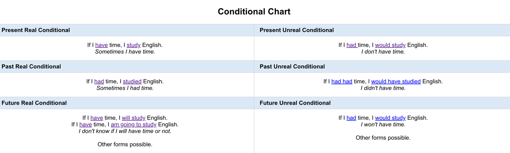

### Conditional Tenses

|Name|Structure (if-clause, main-clause)|Description|
|---|---|---|
|C0. Zero Conditional|`if` + `present simple`, `present simple`|used to talk about what you normally do in real-life situations|
| |`If` you `heat` water until 100 degree, it `boils`|(true in general)|
|C1. Future Real Conditional|`if` + `present simple`, `present future (will + verb)`|what you think you will do in a specific situation in the future|
| | `If` I `see` her, I `will` `tell` her| |
|C2. Present Unreal Conditional|`if` + `past simple`, `would` + `verb`| what you would generally do in imaginary situations |
| |`If` I `won` a lot of money, I `would` `buy` a big house.| |
|C3. Past Unreal Conditional|`if` + `past perfect`, `would` `have` + `past participle`|used to talk about imaginary situations in the past|
| | `if` I `hadn't eaten` so much, I `would have` `lost` weight.| |
|Mixed Unreal Conditional 1 (present-past)|`if` + `the past perfect` (3rd c), `would` + `verb` (2nd c)|Past action or state,  Present result|
| |`If` I `had had` my coffee in the morning, I `would` `feel` better now.| |
| |`If` I `had won` the lottery, I `would` `be` rich.| |
|Mixed Unreal Conditional 2 (past-present)|`if` + `the past simple` (2nd c), `would have` `V3` (3rd c)|Explaining of a past action, affect real state|
| |`if` I `didn't like` boards, I `wouldn't have` `been` a snowboarder.| |
| |`If` I `were` rich, I `would have` `bought` that Ferrari we saw yesterday.| |

#### Conditional Chart

https://www.englishpage.com/conditional/conditionalintro.html#conditional-chart-title

#### Zero. True in general  

- The TV comes on **if** you press the button.
- **If** you heat water until 100 degree, it boils.

(position of **if** doesn't meter)

`if` + `present simple`, `present simple`

#### Conditional 1 (Real/Possible)

- **If** I _see_ her I _will tell_ her
- I _will_ _go_ shopping on the way home **if** I _have_ time.

`if` + `present simple`, `present future (will + verb)`

#### Conditional 2 (Unlikely/Impossible)

`if` + `past simple`, `would` + `verb`

- **If** I _won_ a lot of money I **would** _buy_ a big house.
- **if** I _had_ his number I **would** _call_ him.

#### Conditional 3 (To late now or past)

`if` + `past perfect`, `would` `have` + `past participle` 

- I **would have** _lost_ weight **if** I **hadn't eaten** so much.
- **If** I **had gone** to bed earlier, I **would have** _woken up_ in time to catch the train.

---

### Comparing 2 and 3 Conditional

Compare:
 - I'**m not** hungry. If I **was** hungry, I **would eat** something. (_now_)
 - I **wasn't** hungry. If I **had been** hungry, I **would have eaten** something. (_past_)

---

### Mixed Conditionals

Mixed conditionals are a combination of two types of conditional patterns (usually second and third conditionals).  

https://www.englishpage.com/conditional/mixedconditional.html

Mixed Conditionals may be:
- real
- unreal

#### Mixed Unreal Conditionals (MUC)

1) First MUC: a third conditional in the if clause and a second conditional in the main clause.  
Past action or state,  Present result. 
2) Second MUC: a second conditional in the if clause and a third conditional in the main clause.

#### First Mixed : `if` + `the past perfect` (3rd c), `would` + `verb` (2nd c)

_Past action or state,  Present result_

Notes: 
- usually, we use contractions If I'd had...
- very common, very important

Examples:
- If I _had had_ my coffee in the morning, I _would_ feel better now. 
- If I _hadn't drunk_ a lot of wine yesterday I _wouldn't_ have a bad feeling now.
- If I _hadn't shot_ that man, I _wouldn't be_ in jail.
- If I _hadn't had_ a fight last week I _wouldn't have_ a black eye.
- If I _had won_ the lottery when I was 25, I _would_ have a different life now.

#### Second: `if` + `the past simple` (2nd c), `would have V3` (3rd c)

_ongoing condition or actions that explain past behaviour_

Permanent condition that explains a past action, decision, consequence.

- If clause =  past condition and present condition
- main clause =  past action, decision, or result

Examples:

- if I _didn't like_ boards, I _wouldn't have been_ a snowboarder.
- If I _feared_ criminals, I _wouldn't have lived_ in Cape Town.
- If I _liked_ money, I _would have been_ a businessman.
- If I _wasn't_ afraid of spiders, I _wouldn't have screamed_ when one landed on me.
- If I _knew_ that FTX was corrupt, I _would not have invested_ in cryptocurrency (FTX is a crypto organization). 
- If I _was_ a genius, I _would have become_ an astronaut. 
- If we _knew_ that he was a criminal we _would have fired_ him.

Usual cases:
- If I could speak Chinese, ...
- If I didn't need sleep,...
- If I was a billionaire,...

--- 

### Clauses vs Conditionals

Mnemonic rule:  
- If --> Conditionals   
- Other --> Clauses

#### Time Clauses

- I will visit you _**before** I go home_. (Time Clauses, not conditional)
- _**Before** I go home,_ I will visit you.
- I will visit you **after** I finish work.
- I will visit you **as soon as** I finish work.

Structure:  
_Future tense, present tense_

#### Conditional Clauses

- I will visit you **if** I finish work early.
- **If** I finish work early, I will visit you.

I _will have finished work_ **when** you _arrive_ later.

#### Reason Clauses

- I will go to the shop **because** I need food.
- I will cook **because** I am hungry. (hungry + angry = hangry [slang])

_Structure: use **because**_

#### Result Clauses

- There were power cuts, **so** we sat in the dark.
- Tickets were sold out, **so** we are in South Africa. (Suid Afrika - Afrikaans)

_Structure: use **so**_

#### Purpose Clauses

- I will go to the shop **so that** I can feed myself.
- I will train hard **so that** I can win the competition.

_Structure: use **so that**_

#### Concession Clauses

- I will visit you **although** I don't have much time.
- We will cancel our edits **although** we don't agree between our departments.

_Structure: use **although**_

#### Contrast Clauses

- I like chocolate **but** my wife likes ice cream. (most popular)
- I like chocolate **whereas** my wife likes ice cream.
- I like chocolate **while** my wife likes ice cream.
- I like chocolate, **although** my wife likes ice cream.
- I like strong coffee **but** my fiancee likes latte.

_Structure: use **but, whereas, while, although**_