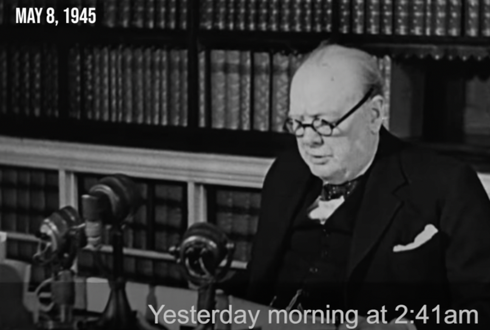

Goal:
Do a transcription for a [Winston Churchill's announce](https://www.youtube.com/watch?v=aJ8cVi2tiH0&feature=youtu.be).

Text: 

"… Yesterday morning at 2.41 a.m. at Headquarters, General Jodl, the representative of the German High Command, and Grand Admiral Doenitz, the designated head of the German State, signed the act of unconditional surrender of all German land, sea, and air forces in Europe to the Allied Expeditionary Force, and simultaneously to the Soviet High Command".

I had used [Cambridge Dictioonary](https://dictionary.cambridge.org/dictionary/english/):

"... ˈjestədeɪ ˈmɔːnɪŋ æt tuː ˈfɔːti wʌn æt ˈhedˌkwɔːtəz, ˈdʒenərəl Jodl, ðə ˌreprɪˈzentətɪv əv ðə German haɪ kəˈmɑːnd, ənd 
ɡrænd ˈædmərəl Doenitz, ðə ˈdezɪɡneɪt (+ ed) hed əv ðə German State, ðə ækt əv ˌʌnkənˈdɪʃənəl sərˈendər əv ɔːl German lænd, siː, ənd eər fɔːs (+s) in ˈjʊə.rəp tuː ðə ˈæl.aɪd ˌek.spəˈdɪʃ.ən.er.i fɔːs, ənd ˌsaɪ.məlˈteɪ.ni.əs.li tuː ðə ˈsəʊ.vi.ət haɪ kəˈmænd "

