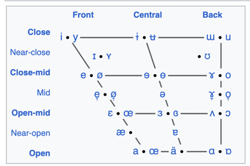

### International Phonetic Alphabet (IPA)

[Read more (wiki)](https://en.wikipedia.org/wiki/International_Phonetic_Alphabet)

#### Vowels

https://en.wikipedia.org/wiki/IPA_vowel_chart_with_audio

#### Other

Also, you can see information about:
- consonants
- tones
- auxiliary symbols

https://en.wikipedia.org/wiki/International_Phonetic_Alphabet_chart